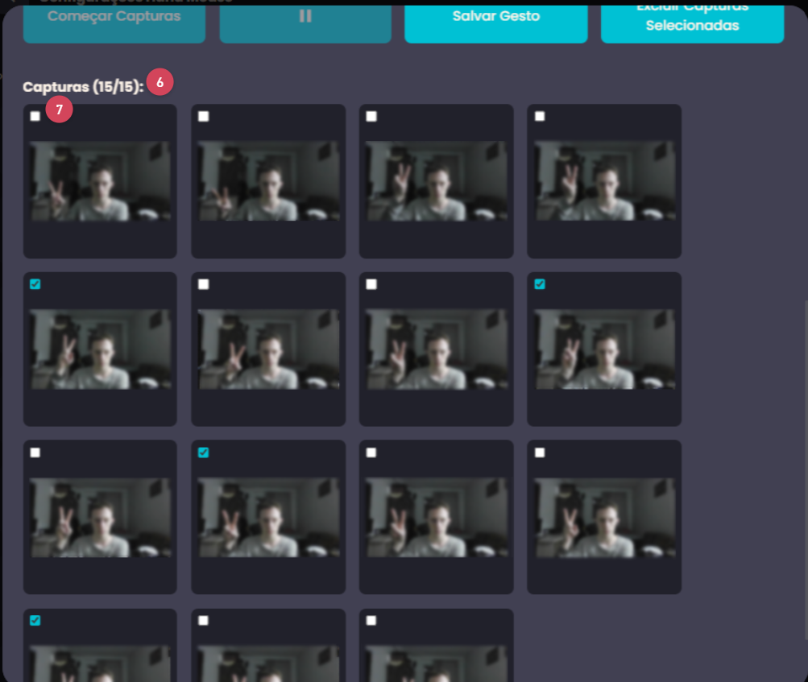

# Hand Mouse Chrome Extension

Hand Mouse is a chrome extension that allows the user to controll its mouse using only hand gestures.  This project was develop by Computer Engineers [Daniel Gustavo Favero](https://github.com/danielg-favero), [Gustavo Alexandre](https://github.com/Gugonunes) and [Jeferson Rosa de Souza](https://github.com/souzjfe).

The main actions that can be performed within web pages are:

- Move the mouse
- Click elements of a page
- Scroll Up
- Scroll Down
- Forward a page
- Backward a page
- Auto Scroll (also known as Free Move)

## Table of Contents

- [How to install](#how-to-install)
- [How to use](#how-to-use)
  - [1. Mouse Controll](#1-mouse-controll)
  - [2. Hand Gesture Customization](#2-hand-gesture-customization)
- [How to customize a gesture](#how-to-customize-a-gesture)
- [Contributing](#contributing)
  - [Branch name conventions](#branch-name-conventions)
  - [Commit conventions](#commit-conventions)

## How to install

*chrome extension page install link soon*


## How to use

The Hand Mouse Chrome Extension comes with the major features

### 1. Mouse Controll

After installing Hand Mouse, open a new tab in chrome, a dialog message asking for camera permissions should appear, upon agreeing, a new toast message should appear informing the initialization of the Hand Mouse. With a success start, the Hand Mouse is up and running.

Once the extension detects a hand from the webcam's / camera's image, one of the following mouse drawings should appear:


This drawings represent these different actions on the page:

1. Move the mouse;
2. Click elements of a page;
3. Scroll Up;
4. Scroll Down;
5. Forward a page;
6. Backward a page;
7. Auto Scroll.

> After new tab creation / loading the extension restarts and load itself again

### 2. Hand Gesture Customization

Opening the extension pop up, some options can be performed


1. Disable Hand Mouse;
2. Turn off camera;
3. Navigate to the gesture customization page.

Upon entering the gesture customization page, the list of mouse actions are displayed as follows:


In this page the user can:

1. Close the page;
2. See the related action in the card's title;
3. Preview gesture (an image of the user performing the gesture is displayed);
4. Edit gesture;
5. Save changes;

Once clicking in the edit button (5), a dialog is displayed as such:




The following actions can be performed once in the dialog:

1. Close the dialog;
2. Webcam preview;
3. Begin captures;
4. Pause captures;
5. Save gesture
6. See the current captures count;
7. Select captures;
8. Delete selected captures;

## How to customize a gesture

Once in the [edit gesture dialog](#2-hand-gesture-customization), make sure the webcam preview is shown correctly, for good practice, think first of the action you want to perform in a web page, after that, click "Começar Capturas" and a sequence of 15 pictures will be taken, with a 2 seconds gap each, any time you want, you can pause and resume the capture sequence, as well as select and delete undesired captures. This process continues until the 15 captures were taken, only then you can click "Salvar gesto" and close the dialog.

The new gesture is only registred in the user's local storage upon clicking "Salvar" in the gesture edit page.

## Contributing

Clone the git repository

```bash
git clone git@github.com:Daguje/hand-mouse-extension.git
```

Change directory

```bash
cd hand-mouse-extension
```

Install the required dependencies

```bash
yarn
```

Run the development server

```bash
yarn dev
```
> This command will create a `dist` directory, wich should be uploaded into chromes extension manager page

### Branch name conventions

For contributing with the project create a new `git` branch from the `master` branch using one of the following prefixes:
- **feature**: for new features;
- **hotfix**: fixing major bugs;
- **bugfix**: fixing minor bugs.

Followed by a short title for the branch. For example:

```bash
git branch -b feature/new-feature
```

### Commit conventions

The commit messages conventions follows the [Conventional Commits](https://www.conventionalcommits.org/pt-br/v1.0.0-beta.4/) pattern.